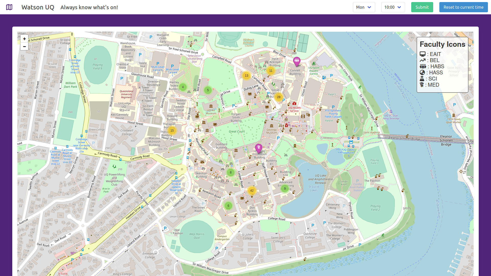
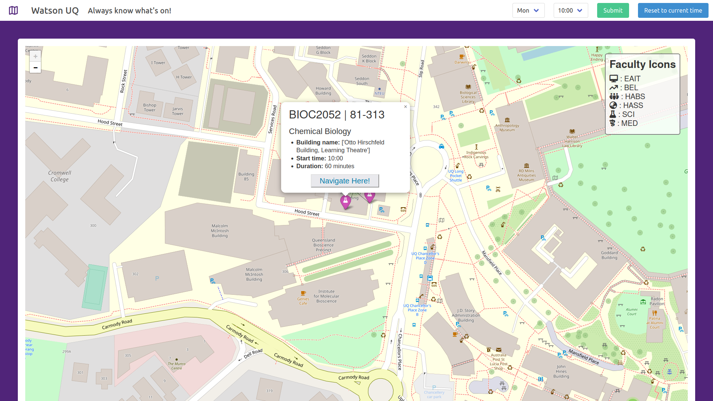
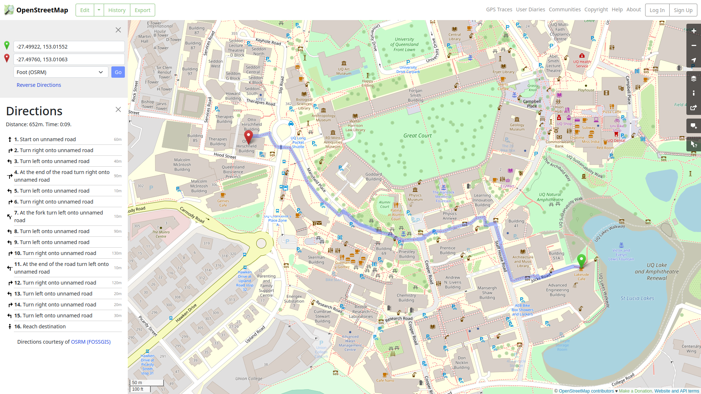

# Watson UQ
Got some free time on your hands? Feeling curious? See what lectures are on and drop by!

## Features
- Display all currently running lectures
- Simulate different days and times: plan ahead!
- Navigate towards lecture rooms via OpenStreetMaps

## Setup
```bash
# in repo root:

# set up virtual environment
python -m venv env

# install requirements
pip install -r requirements.txt

# set up building data
python setup_data.py
```

## Running the server
```bash
cd watson

# server should be running, by default, on localhost:8000
python manage.py runserver
```

## Usage
Open `localhost:8000` in your browser of choice, you should be greeted with an overview of all the currently running lectures on campus based on your system's current time:



Click on any of the clusters or markers, and you can see the details of the lecture:



Click "Navigate Here" to find your way to your chosen lecture!

